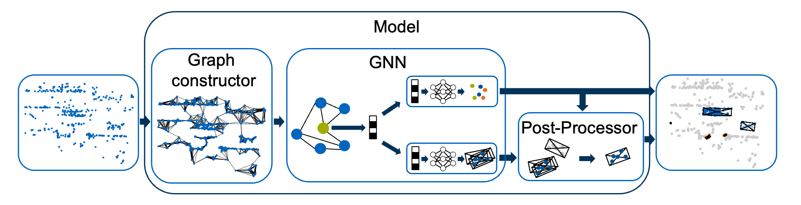

[](https://www.linux.org/)
[](https://www.docker.com/)
[](https://www.python.org/downloads/release/python-380/)

#  RadarGNN
This repository contains an implementation of a graph neural network for the segmentation and object detection in radar point clouds. As shown in the figure below, the model architecture consists of three major components: Graph constructor, GNN, and Post-Processor. 



The focus is on a modular implementation with the possibility to incorporate different invariances and equivariances into the overall model. It is built upon pytorch-geometric and provides usage with the [nuScenes](https://www.nuscenes.org/) and [RadarScenes](https://radar-scenes.com/) dataset.
<br>
<br>

## Results
Results of our RadarGNN model for object detection and semantic segmentation on both the [nuScenes](https://www.nuscenes.org/) and the [RadarScenes](https://radar-scenes.com/) dataset. For more results, please refer to the related [paper](#citation).

### BEV Object Detection and Semantic Segmentation (on RadarScenes)
| Model    | Invariance             | mAP      | F1       |
|----------|------------------------|----------|----------|
| RadarGNN | None                   | 19.4     | 68.1     |
| RadarGNN | Translation            | **56.5** | **77.1** |
| RadarGNN | Translation & Rotation | 19.6     | 76.5     |


### 3D Object Detection and Semantic Segmentation (on nuScenes)
| Model    | Modality | Split | mAP | NDS | F1   |
|----------|----------|-------|-----|-----|------|
| RadarGNN | Radar    | val   | 0.7 | 7.5 | 19.6 |
| RadarGNN | Radar    | test  | 0.7 | 5.9 | -    |

_Note: The RadarGNN model was not designed for 3D object detection on the nuScenes dataset but rather for bird’s-eye view (BEV) object detection on the RadarScenes dataset._
<br>
<br>

## Prerequisites
- OS: `Ubuntu 20.04 LTS`
- CUDA: `11.3`
- cuDNN: `8`
- Docker: `20.10`
- NVIDIA Container Toolkit
<br>

##  Preparation
To get started, first a project folder must be created. This folder contains everything related to this project. Inside the project folder create a "data" folder and within this folder, create a "results" subfolder. The trained models and evaluations will be stored in that folder. Depending on the desired dataset, create the following additional sub folders inside the "data" folder:
- datasets/radarscenes/raw
- datasets/nuscenes

In a second step follow the instructions of the [nuScenes](https://www.nuscenes.org/) and/or [RadarScenes](https://radar-scenes.com/) websites to download and store the datasets in the created sub folders. 

Finally, clone this repository into the project folder using the command:
```
git clone https://github.com/TUMFTM/RadarGNN.git
```

<details>
<summary>If you use the RadarScenes dataset, your folder structure should now look like this: </summary>

```
.
|  
+---data/  
|   |  
|   +---datasets/  
|   |   |  
|   |   +---radarscenes/  
|   |   |   |
|   |   |   +---raw/                
|   |   |   |   |
|   |   |   |   +---License.md
|   |   |   |   |
|   |   |   |   +---data/        
|   |
|   +---results/  
| 
+---docs/
|
+---configurations/
|   
+---test/
|
+---src/  
|
+---...
```
</details>
<br>

## Installation
It is recommended to use the provided [Dockerfile](Dockerfile) to build the development environment. However, if you don't want to use docker, you can also install the packages defined in [Dockerfile](Dockerfile) and [requirements.txt](requirements.txt) manually. To set up the environment with docker, run the following commands inside the repository folder:

1. Ensure the you are inside the repository folder.
```
cd radargnn/
```
2. Create the docker image.
```
docker build -t gnn:1.0 .
```
3. Run the container with GPU support and mount the "data" and "configurations" folder. By using the "-it" flag, the container is run in an interactive mode, so that you are directly inside the container after executing the command. Since the "data" and "configurations" folder are mounted, any changes in these folders are automatically mirrored from your local machine into the running docker container and vice versa. 
```
docker run -it --rm --gpus all -v ${local_path_to_data_folder}$:/app/data -v ${local_path_to_configurations_folder}$:/app/configurations gnn:1.0
```
4. Install the radargnn package inside the container.
```
python3 -m pip install -e .
```
<br />

##  Usage
The overall pipeline is divided into three major steps. 

- Creation of a graph-dataset from the raw RadarScenes or nuScenes dataset
- Creation and training of a model based on the created graph-dataset
- Evaluation of the trained model

The settings of all three steps are defined in a unified configuration file, which must consequently be created first.
### 1. Create a configuration file 
The configuration file contains three sections with relevant settings for the corresponding steps (dataset creation, training, evaluation). It can be created based on the provided [configuration description](/configurations/configuration_description.yml) and [configuration template](/configurations/configuration_template.yml).
<br />

### 2. Create a graph-dataset
Next, the graph-dataset needs to be created by converting the radar point clouds of the raw datasets to a graph data structure. To do this, execute the following command inside the docker container: 
```
python3 src/radargnn/create_dataset.py --dataset ${path_to_raw_dataset_folder}$ --config ${path_to_config_file}$
```

```
usage:          create_dataset.py [--dataset] [--config]

arguments:
    --dataset   Path to the raw (RadarScenes/nuScenes) dataset
    --config    Path to the created configuration.yml file
```

The created graph-dataset is saved in the automatically created folder "{path_to_dataset}/processed". After creating the graph-dataset, this folder may be renamed.
<br />

### 3. Create and train a model
In a next step, you can use the created graph-dataset to train a model. To do this, run the following command inside the docker container: 
```
python3 src/radargnn/train.py --data ${path_to_graph_dataset_folder}$ --results ${path_to_results_folder}$ --config ${path_to_config_file}$
```
```
usage:             train.py [--data] [--results] [--config]

arguments:
    --data         Path to the created graph-dataset
    --results      Path to the created "results" folder
    --config       Path to the created configuration.yml file
```

Within the provided "results" folder, a new "model" folder is automatically created, in which the trained model is saved.
<br />

### 4. Evaluate a trained model 
Finally, you can evaluate a trained model using the following command inside the docker container: 
```
python3 src/radargnn/evaluate.py --data ${path_to_graph_dataset_folder}$ --model ${path_to_model_folder}$ --config ${path_to_config_file}$ 
```
```
usage:             evaluate.py [--data] [--model] [--config]

arguments:
    --data         Path to the created graph-dataset (The same as used for the training of the model to evaluate)
    --model        Path to the folder in which the trained model is saved
    --config       Path to the created configuration.yml file
```
Within the provided "model" folder a new "evaluation" folder is created, in which the evaluation results are saved.
